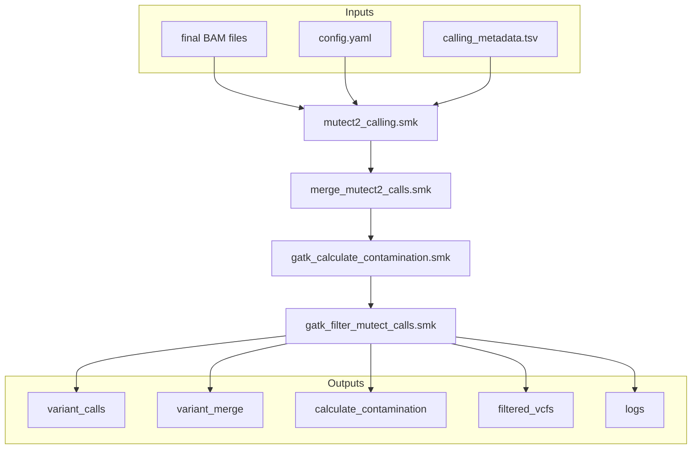

# SM-CALLING

This repository contains a set of Snakemake workflows designed for variant calling using GATK's MuTect2. The pipeline supports preprocessing steps such as merging VCF files, calculating contamination, and filtering variant calls. It is designed to be flexible and customizable through configuration files.

## Requirements

- Snakemake
- Conda
- GATK (installed through Conda in the pipeline)
- Bcftools (for VCF file operations)

## Installation

1. Clone this repository to your local system.
2. Ensure you have all the required software installed.

## Configuration

Before running the pipeline, you need to configure the following files:

### `config.yaml`

This file contains the settings for the pipeline. Here are the details of the settings that you can configure:

- `final_bam_folder`: The folder containing the final BAM files.
- `final_bam_file_extension`: (Optional) The extension of the BAM files (default: ".bam").
- `output_folder`: The folder where the output files will be stored.
- `reference_unpacked`: The path to the reference genome file.
- `panel_of_normals`: The path to the Panel of Normals file.
- `af_only_gnomad`: The path to the allele frequency only gnomAD file.
- `mutect_scatter_by_chromosome`: (Optional) Set to `True` to enable scattering by chromosome, `False` otherwise (default: `False`).

### `calling_metadata.tsv`

This file contains the metadata for the analyses to be run. It should contain the following columns:

- `individual1`: The identifier for the first individual.
- `individual2`: (Optional) The identifier for the second individual. Leave empty for tumor-only analyses.
- `analysis`: The type of analysis to be performed (e.g., "To" for tumor-only).
- `sample1`: The name of the first sample (tumor sample).
- `sample2`: (Optional) The name of the second sample (normal sample). Leave empty for tumor-only analyses.
- `bam1_file_basename`: The basename of the BAM file for the first sample.
- `bam2_file_basename`: (Optional) The basename of the BAM file for the second sample. Leave empty for tumor-only analyses.

## Running the Pipeline

The pipeline is executed in a specific order using the provided shell scripts. Below is the order of execution along with a brief description of each step:

1. **MuTect2 Calling** (`mutect2_calling.smk`):
    - This script performs variant calling using GATK's MuTect2 on the provided BAM files.
    - To run this step, use the following command:
      ```sh
      sbatch run_mutect2_calling.sh
      ```

2. **Merge MuTect2 Calls** (`merge_mutect2_calls.smk`):
    - This script merges the VCF files generated in the previous step using GATK's GatherVcfs, and merges stats files using GATK's MergeMutectStats. It also processes f1r2 files for LearnReadOrientationModel.
    - To run this step, use the following command:
      ```sh
      sbatch run_merge_mutect2_calls.sh
      ```

3. **Calculate Contamination** (`gatk_calculate_contamination.smk`):
    - This script calculates the contamination in the sample using GATK's CalculateContamination.
    - To run this step, use the following command:
      ```sh
      sbatch run_gatk_calculate_contamination.sh
      ```

4. **Filter MuTect Calls** (`gatk_filter_mutect_calls.smk`):
    - This script filters the merged VCF files to remove false positives using GATK's FilterMutectCalls.
    - To run this step, use the following command:
      ```sh
      sbatch run_gatk_filter_mutect_calls.sh
      ```

## Output

The pipeline produces the following outputs in the `output_folder` specified in the `config.yaml`:

- `variant_calls`: A folder containing the initial VCF files with the variant calls.
- `variant_merge`: A folder containing merged VCF files, stats files, and orientation model files.
- `calculate_contamination`: A folder containing contamination tables and segment tables.
- `filtered_vcfs`: A folder containing the final filtered VCF files.
- `logs`: A folder containing the log files for each step of the pipeline.

Each VCF file is named with the format `<individual1>_<analysis>_<chromosome>.vcf.gz`.

## Pipeline Diagram



## License
This project is licensed under the MIT License. See the LICENSE file for more details.